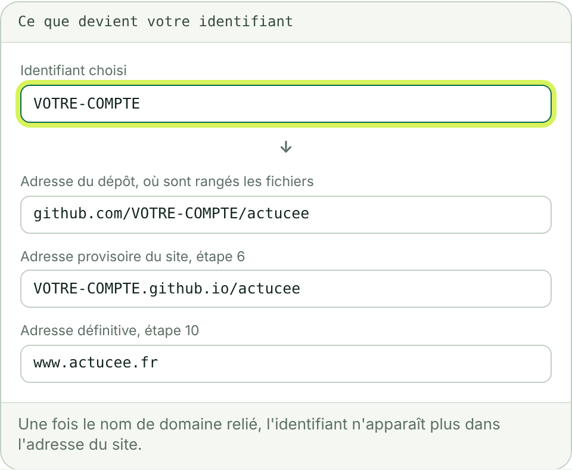
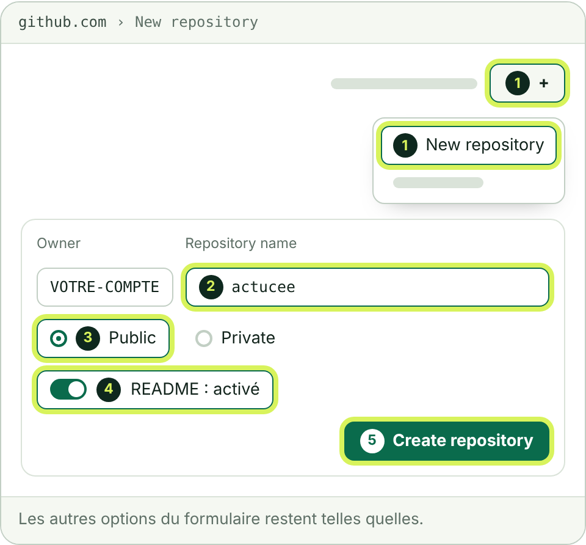
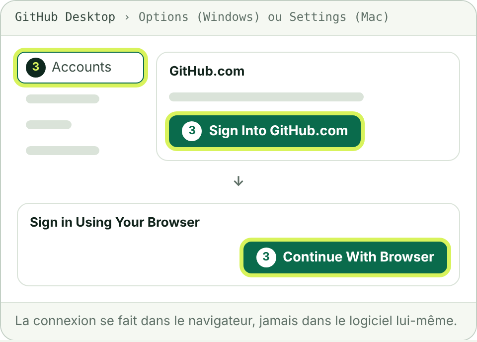
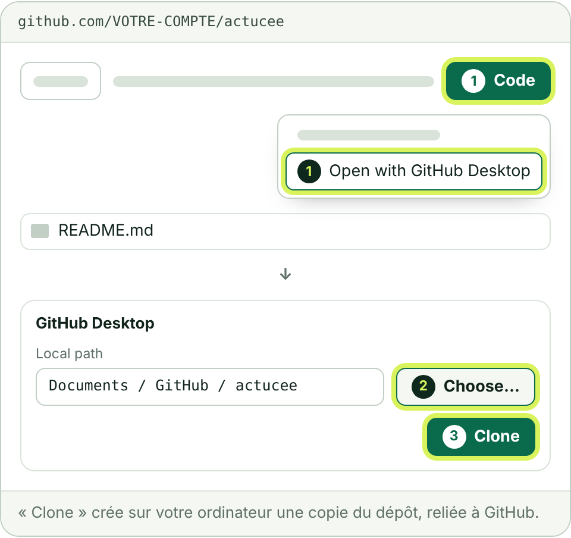
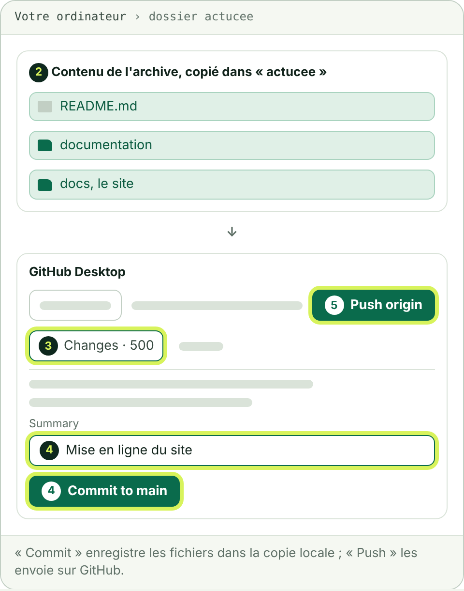
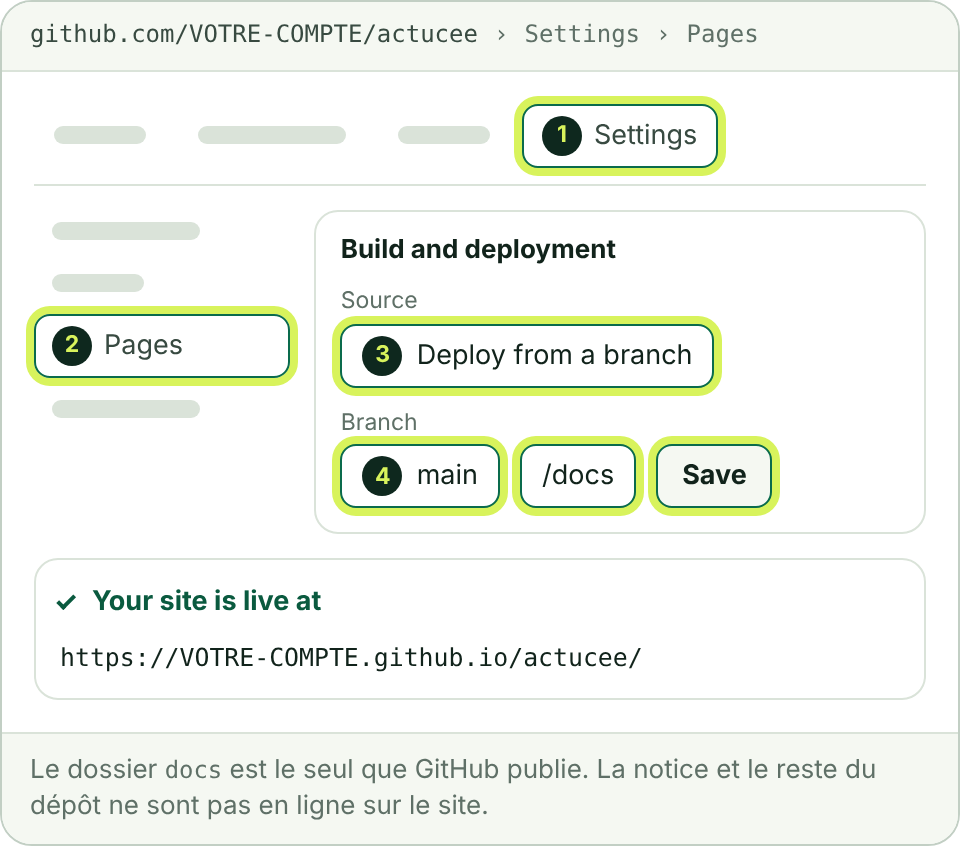

# 1. Mettre le site en ligne sur GitHub

Six étapes, une trentaine de minutes. À la fin, le site est visible à l'adresse provisoire `https://VOTRE-COMPTE.github.io/actucee/`. Rien n'est encore changé chez OVH.

**Pour lire ce guide**

- `VOTRE-COMPTE` désigne votre identifiant GitHub.
- GitHub est en anglais : ses libellés sont repris tels quels, entre guillemets.
- Les schémas ne montrent que les éléments utiles de chaque écran. Les pastilles numérotées reprennent les numéros des gestes.

**Ce qu'il vous faut**

- L'archive `actu-cee-depot-github.zip`, dézippée sur votre ordinateur. Elle contient `README.md`, le dossier `documentation` et le dossier `docs`, qui est le site.
- Une adresse e-mail pour créer le compte GitHub.

## Étape 1 : créer votre compte GitHub

1. Ouvrez [github.com](https://github.com/) et cliquez sur « Sign up ».
2. Suivez les écrans : adresse e-mail, mot de passe, identifiant, puis vérification de l'adresse e-mail.
3. Notez l'identifiant choisi : il sert dans toute la suite.

L'identifiant figure dans l'adresse provisoire du site. Prenez le nom de votre société ou le vôtre, sans espace ni accent. Le compte gratuit suffit.

**Vous devez voir** la page d'accueil de GitHub, avec votre compte ouvert en haut à droite.

## Étape 2 : créer le dépôt « actucee »

Un dépôt (« repository ») est le dossier en ligne qui contient le site.

1. En haut à droite de GitHub, cliquez sur « + », puis sur « New repository ».
2. Dans le nom du dépôt (« Repository name »), saisissez `actucee`.
3. Laissez la visibilité sur « Public ».
4. Activez l'option qui ajoute un fichier README.
5. Cliquez sur « Create repository ».

> Avec un compte gratuit, GitHub ne publie un site que depuis un dépôt public : tout ce que vous y déposez est lisible par tous. L'archive à déposer ne contient que le site et sa notice. Le programme qui fabrique le site et le plan de mots-clés sont dans l'archive « sources », à garder pour vous.

**Vous devez voir** la page du dépôt, à l'adresse `github.com/VOTRE-COMPTE/actucee`, avec un seul fichier : README.md.

## Étape 3 : installer GitHub Desktop et vous connecter

GitHub Desktop est le logiciel gratuit de GitHub qui envoie des fichiers de votre ordinateur vers le dépôt. Il fonctionne sous Windows 10 (64 bits) ou plus récent et sous macOS 12 ou plus récent.

1. Ouvrez [desktop.github.com](https://desktop.github.com/), cliquez sur « Download for Windows » ou « Download for macOS », puis lancez le fichier téléchargé.
2. Dans le logiciel, ouvrez les réglages : menu « File », puis « Options » sous Windows ; menu « GitHub Desktop », puis « Settings » sur Mac.
3. Dans le volet « Accounts », cliquez sur « Sign Into GitHub.com », puis sur « Continue With Browser ».
4. Votre navigateur s'ouvre : connectez-vous à GitHub et acceptez le retour vers GitHub Desktop.

Si le logiciel propose de vous connecter dès son premier lancement, acceptez : le résultat est le même.

**Vous devez voir** votre identifiant GitHub dans le volet « Accounts ».

## Étape 4 : copier le dépôt sur votre ordinateur

1. Sur la page du dépôt, cliquez sur le bouton « Code », puis sur « Open with GitHub Desktop ». Acceptez l'ouverture du logiciel si le navigateur le demande.
2. Dans GitHub Desktop, cliquez sur « Choose... » pour choisir où ranger le dossier, par exemple dans Documents.
3. Cliquez sur « Clone ».

**Vous devez voir** le nom « actucee » en haut à gauche de GitHub Desktop, et un dossier « actucee » à l'emplacement choisi. Il contient le fichier README.md.

## Étape 5 : déposer les fichiers du site

1. Ouvrez le dossier « actucee » créé à l'étape 4 : dans GitHub Desktop, menu « Repository », puis « Show in Explorer » sous Windows ou « Show in Finder » sur Mac.
2. Ouvrez à côté le dossier dézippé de l'archive. Copiez tout son contenu dans le dossier « actucee » : `README.md`, `documentation` et `docs`. Acceptez de remplacer README.md.
3. Revenez dans GitHub Desktop : l'onglet « Changes » liste environ 500 fichiers.
4. En bas à gauche, écrivez dans « Summary » : `Mise en ligne du site`, puis cliquez sur « Commit to main ».
5. Cliquez sur « Push origin », en haut de la fenêtre.

« Commit » enregistre les fichiers dans la copie locale ; « Push » les envoie sur GitHub.

**Vous devez voir**, sur la page du dépôt rechargée, les dossiers `docs` et `documentation` à côté de README.md.

## Étape 6 : publier le site avec GitHub Pages

1. Sur la page du dépôt, cliquez sur l'onglet « Settings ».
2. Dans le menu de gauche, cliquez sur « Pages ».
3. Sous « Build and deployment », laissez « Source » sur « Deploy from a branch ».
4. Sous « Branch », choisissez « main », puis le dossier « /docs », et cliquez sur « Save ».
5. Patientez une à deux minutes, puis rechargez la page.

**Vous devez voir**, en haut de la page, l'adresse du site : `https://VOTRE-COMPTE.github.io/actucee/`. Ouvrez-la : la page d'accueil d'Actu CEE s'affiche.

**Si ça coince**

- La page affiche le texte de la notice ou une erreur 404 : le dossier choisi n'est pas « /docs ». Corrigez et enregistrez.
- Rien après cinq minutes : ouvrez l'onglet « Actions » du dépôt. La ligne « pages build and deployment » doit porter une coche verte ; une croix rouge se relance avec le bouton « Re-run jobs ».
- L'adresse provisoire renvoie vers www.actucee.fr : le fichier `docs/CNAME` est déjà présent dans le dépôt. Ce n'est pas une erreur, passez au guide 2.

Suite : [2. Relier le nom de domaine OVH](2-relier-le-nom-de-domaine-ovh.md).

Sources : GitHub Docs, [créer un dépôt](https://docs.github.com/en/repositories/creating-and-managing-repositories/creating-a-new-repository), [GitHub Desktop](https://docs.github.com/en/desktop), [source de publication de GitHub Pages](https://docs.github.com/en/pages/getting-started-with-github-pages/configuring-a-publishing-source-for-your-github-pages-site).
