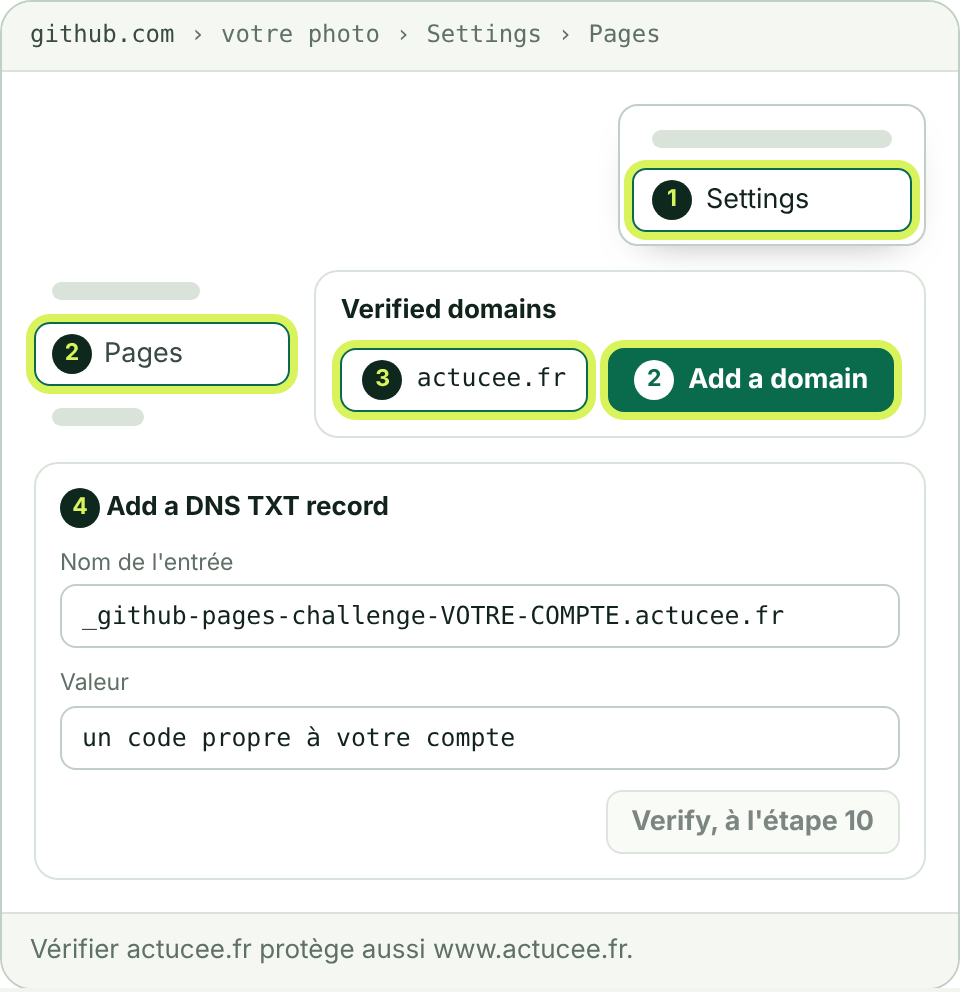
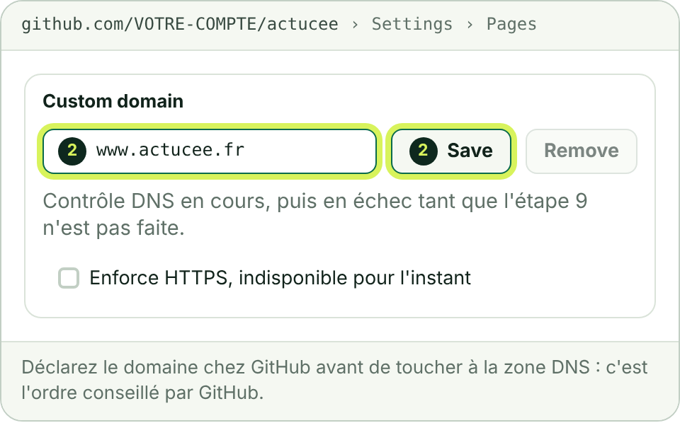
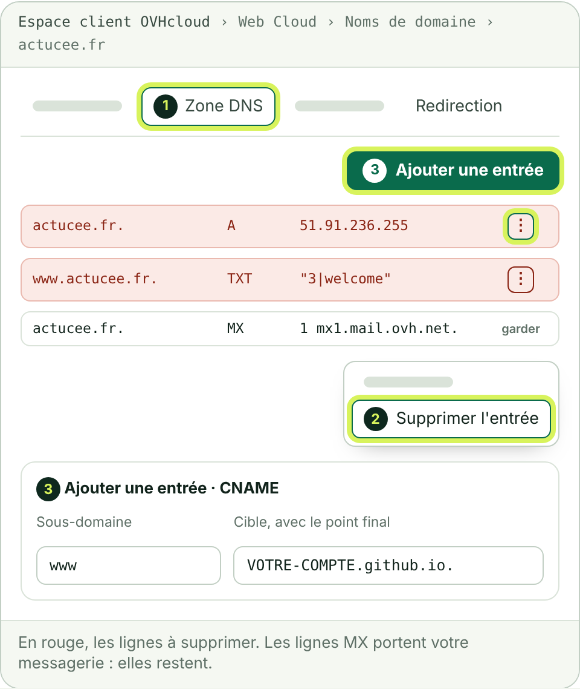
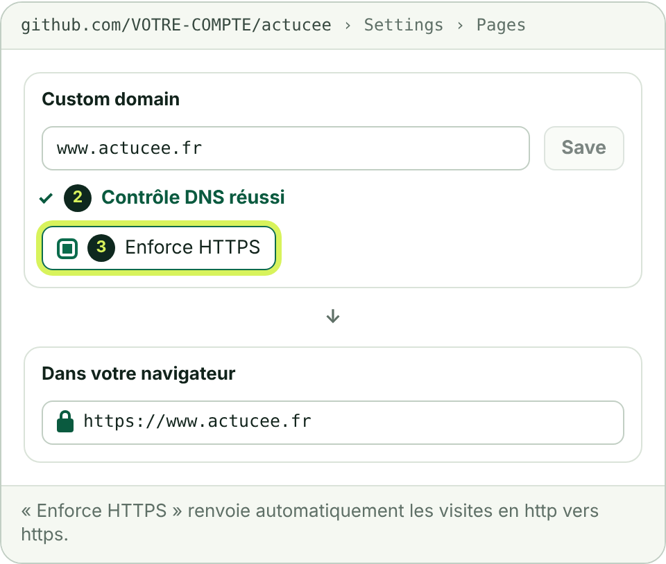
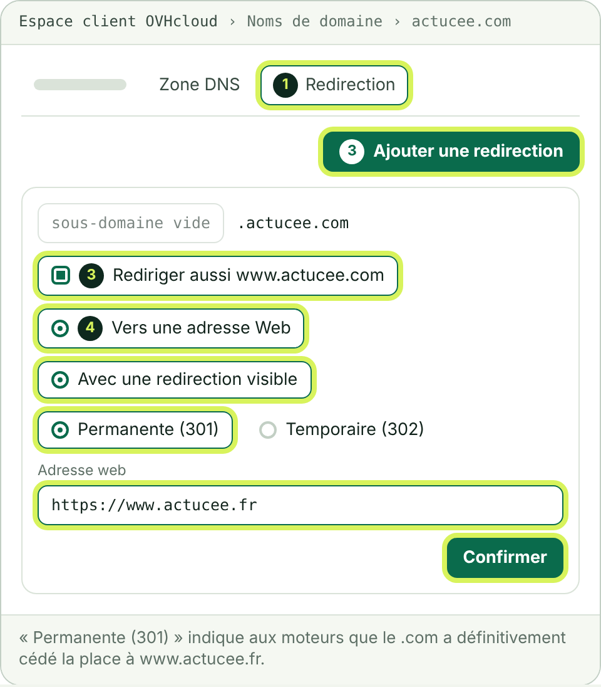

# 2. Relier le nom de domaine OVH

Cinq étapes, un quart d'heure de manipulations, puis jusqu'à 24 heures d'attente. À la fin, le site répond sur **https://www.actucee.fr**. Votre messagerie OVH n'est pas touchée : ses réglages restent en place.

À faire après le [guide 1](1-mettre-en-ligne-sur-github.md). `VOTRE-COMPTE` désigne votre identifiant GitHub.

**Ce qu'il vous faut** : vos identifiants OVHcloud, ceux du compte qui gère actucee.fr et actucee.com.

## Étape 7 : faire reconnaître votre domaine par GitHub

GitHub recommande de prouver que le domaine vous appartient avant de l'utiliser : personne d'autre ne pourra alors le rattacher à un site GitHub.

1. Cliquez sur votre photo, en haut à droite de GitHub, puis sur « Settings ». Ce sont les réglages du compte, pas ceux du dépôt.
2. Dans le menu de gauche, cliquez sur « Pages », puis sur « Add a domain ».
3. Saisissez `actucee.fr` et cliquez sur « Add domain ».
4. GitHub affiche une entrée TXT à créer : un nom qui commence par `_github-pages-challenge-` et un code. Gardez cet onglet ouvert : vous copierez ces deux valeurs à l'étape 9.

**Vous devez voir** le domaine actucee.fr dans la liste, en attente de vérification. Vérifier actucee.fr protège aussi www.actucee.fr.

## Étape 8 : déclarer www.actucee.fr dans le dépôt

1. Revenez dans le dépôt : onglet « Settings », puis « Pages » dans le menu de gauche.
2. Dans « Custom domain », saisissez `www.actucee.fr` et cliquez sur « Save ».

**Vous devez voir** GitHub lancer un contrôle DNS, qui échoue pour l'instant : c'est attendu, la zone DNS n'est pas encore modifiée.

À partir de maintenant, l'adresse provisoire renvoie vers www.actucee.fr, qui affiche encore la page d'attente d'OVH. GitHub ajoute de lui-même un fichier nommé `CNAME` dans le dossier `docs` : ne le supprimez pas.

Déclarez le domaine chez GitHub avant de toucher à la zone DNS : c'est l'ordre conseillé par GitHub.

## Étape 9 : modifier la zone DNS de actucee.fr chez OVH

La zone DNS indique vers quel serveur conduit votre nom de domaine. Aujourd'hui, elle conduit à la page d'attente d'OVH.

1. Dans votre [espace client OVHcloud](https://www.ovh.com/manager/), ouvrez « Web Cloud », « Noms de domaine », « actucee.fr », puis l'onglet « Zone DNS ».
2. Supprimez les six entrées du premier tableau : sur chaque ligne, menu « ⋮ », puis « Supprimer l'entrée ».
3. Créez les six entrées du deuxième tableau : bouton « Ajouter une entrée », choisissez le type, remplissez le sous-domaine et la cible, puis validez.
4. Ne modifiez aucune autre ligne.

### À supprimer : 6 entrées

Valeurs relevées le 9 octobre 2026 dans les serveurs DNS publics.

| Type | Sous-domaine | Cible ou valeur actuelle |
| --- | --- | --- |
| `A` | *vide* | `51.91.236.255` |
| `AAAA` | *vide* | `2001:41d0:301::29` |
| `TXT` | *vide* | `"1\|www.actucee.fr"` |
| `A` | `www` | `51.91.236.255` |
| `AAAA` | `www` | `2001:41d0:301::29` |
| `TXT` | `www` | `"3\|welcome"` |

### À créer : 6 entrées

« Vide » signifie : laissez le champ sous-domaine vide.

| Type | Sous-domaine | Cible ou valeur |
| --- | --- | --- |
| `A` | *vide* | `185.199.108.153` |
| `A` | *vide* | `185.199.109.153` |
| `A` | *vide* | `185.199.110.153` |
| `A` | *vide* | `185.199.111.153` |
| `CNAME` | `www` | `VOTRE-COMPTE.github.io.` |
| `TXT` | `_github-pages-challenge-VOTRE-COMPTE` | le code affiché par GitHub à l'étape 7 |

### À garder telles quelles

Ainsi que toute autre ligne absente des deux tableaux précédents.

| Type | Sous-domaine | Valeur | Rôle |
| --- | --- | --- | --- |
| `NS` | *vide* | `dns111.ovh.net.` et `ns111.ovh.net.` | serveurs DNS d'OVH |
| `MX` | *vide* | `mx1.mail.ovh.net.`, `mx2.mail.ovh.net.`, `mx3.mail.ovh.net.` | réception des e-mails |
| `TXT` | *vide* | `"v=spf1 include:mx.ovh.com -all"` | envoi des e-mails |

### Les quatre pièges

- **Le point final.** La cible du CNAME se termine par un point. Sans lui, OVH ajoute « actucee.fr » à la suite et l'adresse devient fausse.
- **Le nom de l'entrée TXT.** GitHub affiche le nom complet, qui se termine par `.actucee.fr`. Dans le champ sous-domaine d'OVH, ne saisissez que le début, jusqu'à votre identifiant.
- **Deux lignes TXT sans sous-domaine.** Ne supprimez que celle qui commence par `1|`. Celle qui commence par `v=spf1` sert à votre messagerie.
- **L'ordre.** Supprimez les trois lignes « www » avant de créer le CNAME : OVH indique qu'un CNAME et un TXT sur le même sous-domaine se perturbent.

**Vous devez voir**, dans la zone DNS : quatre lignes A vers 185.199.108.153 à 185.199.111.153, une ligne CNAME pour www, une ligne TXT de vérification, et toujours vos lignes MX. OVH annonce jusqu'à 24 heures de propagation ; c'est souvent moins d'une heure.

**Facultatif : quatre entrées AAAA pour les connexions IPv6.** GitHub les propose en complément des entrées A, qui suffisent. Type AAAA, sous-domaine vide, une entrée par adresse : `2606:50c0:8000::153`, `2606:50c0:8001::153`, `2606:50c0:8002::153`, `2606:50c0:8003::153`.

## Étape 10 : faire vérifier le domaine et activer HTTPS

À faire une fois la zone DNS propagée. Si un contrôle échoue, attendez une heure et recommencez.

1. Réglages du compte GitHub, « Pages » : sur la ligne actucee.fr, ouvrez le menu de la ligne, cliquez sur « Continue verifying », puis sur « Verify ».
2. Réglages du dépôt, « Pages » : le contrôle DNS de www.actucee.fr doit être réussi.
3. Cochez « Enforce HTTPS » dès que la case est disponible. GitHub demande d'abord un certificat, ce qui peut prendre jusqu'à 24 heures.

**Vous devez voir** `https://www.actucee.fr` afficher le site, avec le cadenas du navigateur. L'adresse actucee.fr, sans www, y renvoie d'elle-même.

**Si ça coince**

- La page d'attente d'OVH s'affiche encore : la propagation n'est pas terminée, ou l'une des six entrées à supprimer est restée dans la zone.
- La case « Enforce HTTPS » reste indisponible après plusieurs heures : dans « Custom domain », cliquez sur « Remove », ressaisissez www.actucee.fr, puis « Save ». C'est la procédure indiquée par GitHub pour relancer le certificat.
- Ne supprimez pas l'entrée TXT de vérification après coup : GitHub demande de la conserver.

## Étape 11 : rediriger actucee.com vers www.actucee.fr

GitHub ne sert qu'un nom de domaine par site. Le .com est donc redirigé par OVH, pour qu'une seule adresse soit référencée.

1. Dans l'espace client OVHcloud : « Web Cloud », « Noms de domaine », « actucee.com », onglet « Redirection ».
2. Si une redirection figure déjà dans la liste, supprimez-la.
3. Cliquez sur « Ajouter une redirection ». Laissez le sous-domaine vide et cochez « Rediriger aussi » pour www.actucee.com.
4. Choisissez « Vers une adresse Web », « Avec une redirection visible », puis « Permanente (301) ». Saisissez `https://www.actucee.fr` et cliquez sur « Confirmer ».

**Vous devez voir**, sous 4 à 24 heures, actucee.com et www.actucee.com conduire à www.actucee.fr.

Si OVH signale que des entrées existent déjà pour www, acceptez leur remplacement. Limite annoncée par OVH : cette redirection ne traite pas une adresse du .com saisie avec https:// devant. C'est sans effet sur le référencement, puisque seul www.actucee.fr est déclaré aux moteurs.

Suite : [4. Mentions légales et référencement](4-mentions-legales-et-referencement.md).

## Sources

- GitHub Docs : [nom de domaine personnalisé d'un site GitHub Pages](https://docs.github.com/en/pages/configuring-a-custom-domain-for-your-github-pages-site/managing-a-custom-domain-for-your-github-pages-site) (adresses des entrées A et AAAA, cible du CNAME, ordre des opérations), [vérification d'un domaine](https://docs.github.com/en/pages/configuring-a-custom-domain-for-your-github-pages-site/verifying-your-custom-domain-for-github-pages), [HTTPS](https://docs.github.com/en/pages/getting-started-with-github-pages/securing-your-github-pages-site-with-https).
- OVHcloud : [éditer une zone DNS](https://docs.ovhcloud.com/fr/guides/web-cloud/domains/dns-zone-edit), [créer un enregistrement CNAME](https://docs.ovhcloud.com/fr/guides/web-cloud/domains/dns-zone-cname-record-creation), [rediriger un nom de domaine](https://docs.ovhcloud.com/fr/guides/web-cloud/domains/redirect-domain-name), [historique d'une zone DNS](https://docs.ovhcloud.com/fr/guides/web-cloud/domains/dns-zone-history).

Les écrans de GitHub et d'OVH évoluent : si un libellé diffère, cherchez le libellé le plus proche.
