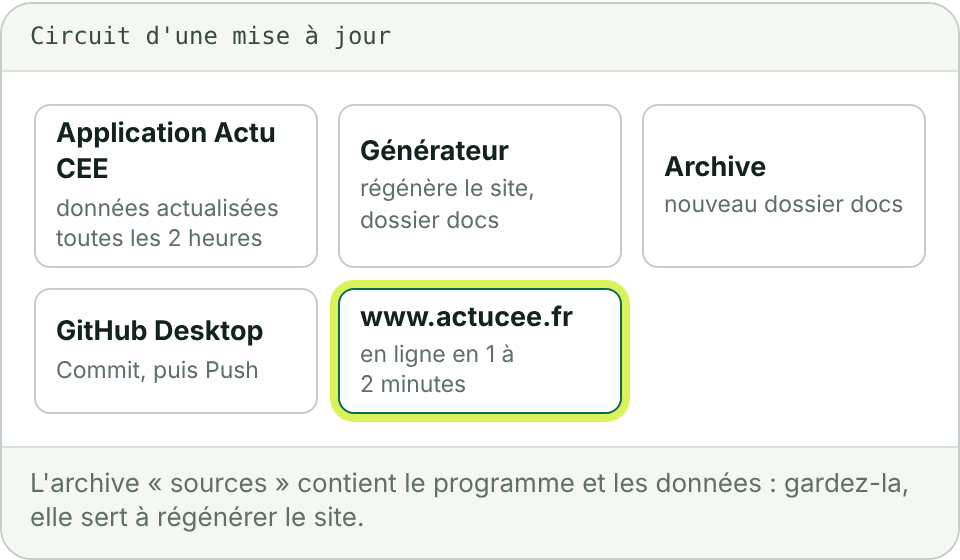

# 3. Mettre à jour le site

Le site est une photographie des données de l'application Actu CEE à une date donnée. Cette date figure sur la page « À propos » du site.

## Quand

- À chaque cotation mensuelle du registre Emmy, publiée en général dans les dix premiers jours du mois.
- À chaque texte CEE publié au Journal officiel : arrêté de fiches, bonification, programme.
- Après toute correction des mentions légales.

## Comment : quatre gestes



1. **Faire régénérer le site.** Le générateur de l'archive « sources » produit un nouveau dossier `docs` à partir des données de l'application. Vous recevez une archive `actu-cee-depot-github.zip` à jour.
2. **Mettre votre copie à niveau.** Dans GitHub Desktop, cliquez sur « Fetch origin », puis sur « Pull origin » si le bouton apparaît.
3. **Remplacer le dossier `docs`.** Dans le dossier « actucee » de votre ordinateur, supprimez le dossier `docs` et copiez à sa place celui de la nouvelle archive. Supprimer d'abord l'ancien dossier évite de laisser en ligne des pages qui n'existent plus.
4. **Envoyer.** Dans GitHub Desktop : un résumé dans « Summary », par exemple `Mise à jour d'octobre 2026`, puis « Commit to main » et « Push origin ».

**Vous devez voir** le site à jour sur www.actucee.fr une à deux minutes plus tard.

## Vérifier après l'envoi

- La page d'accueil affiche le dernier mois de cotation.
- La page « À propos » affiche la nouvelle date des données.
- Dans l'onglet « Actions » du dépôt, la dernière ligne « pages build and deployment » porte une coche verte.

## Ce que contient le nouveau dossier `docs`

Le générateur y écrit, en plus des pages :

| Fichier | Rôle |
| --- | --- |
| `CNAME` | le nom de domaine du site, `www.actucee.fr` |
| `.nojekyll` | demande à GitHub de publier les fichiers tels quels |
| `sitemap.xml` | la liste datée des pages, pour les moteurs de recherche |
| `robots.txt` | l'adresse du plan de site |
| `llms.txt` | une présentation du site pour les assistants |
| `404.html` | la page affichée quand une adresse n'existe pas |

Sous macOS, les fichiers dont le nom commence par un point sont masqués dans le Finder. Ils sont bien copiés avec le dossier `docs`.

## Régénérer soi-même

L'archive « sources » contient le générateur, écrit en Python (version 3.12 ou plus récente, sans dépendance), et l'export des données.

```
python3 generateur/build_site.py
```

La commande lit ses réglages dans `generateur/site.json` (adresse du site, date des données, mentions de l'éditeur) et écrit le dossier `docs` à côté du dossier `generateur`. Elle s'arrête avec un message si un lien interne est cassé ou si une donnée structurée est invalide : rien n'est alors à déposer.

Pour rafraîchir les données elles-mêmes, il faut un nouvel export de la base de l'application : un dossier par collection, un fichier JSON par document, dans `generateur/export`.
